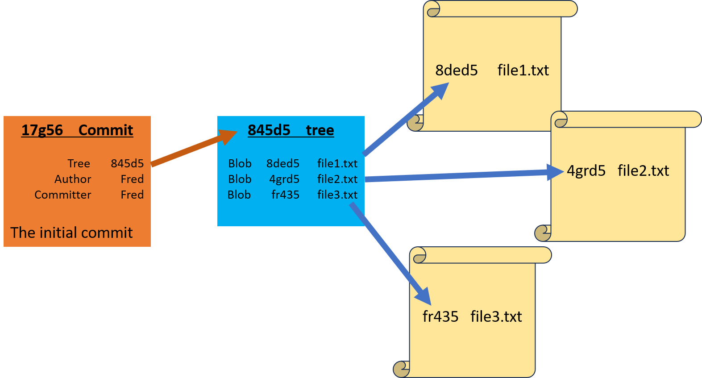
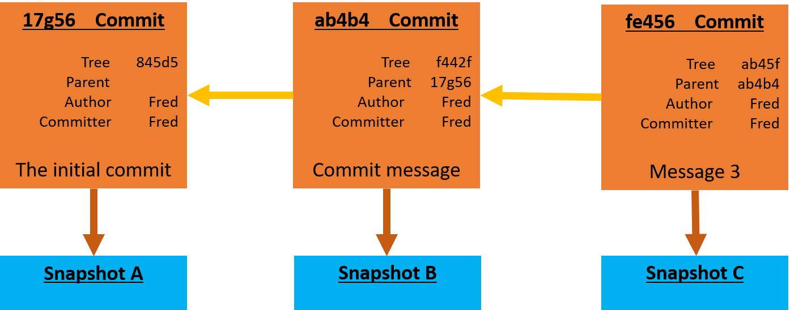

Branching in Git is a powerful feature that allows developers to diverge from the main line of development (usually referred to as the `master` branch) and work on separate, isolated lines of development. Each branch represents an independent line of development, enabling multiple features, fixes, or experiments to be worked on simultaneously without interfering with each other. Branching can be a crucial part of software development, as it allows teams to work collaboratively on different features or fixes simultaneously while maintaining a clear and organized codebase. Isolating work in branches, changing context, and integrating changes into the main line of development can help streamline the development process and improve collaboration.

## **What are Branches?**

Git doesn’t store data as a series of changesets or differences, but instead as a series of snapshots. When you make a commit, Git stores a commit object that contains a pointer to the snapshot of the content you staged. This object also contains the author’s name and email address, the message that you typed, and pointers to the commit or commits that directly came before this commit (its parent or parents): zero parents for the initial commit, one parent for a normal commit, and multiple parents for a commit that results from a merge of two or more branches.

Let’s assume that you have a directory containing three files, and you stage them all and commit. Staging the files computes a checksum for each one (the SHA-1 hash), stores that version of the file in the Git repository (Git refers to them as blobs), and adds that checksum to the staging area:

```bash
$ git add .
$ git commit -m "initial commit"
```
When you create the commit by running git commit, Git checksums each subdirectory (in this case, just the root project directory) and stores them as a tree object in the Git repository. Git then creates a commit object that has the metadata and a pointer to the root project tree so it can re-create that snapshot when needed.

Your Git repository now contains five objects: three blobs (each representing the contents of one of the three files), one tree that lists the contents of the directory and specifies which file names are stored as which blobs, and one commit with the pointer to that root tree and all the commit metadata.



If you make some changes and commit again, the next commit stores a pointer to the commit that came immediately before it.



A branch in Git is simply a lightweight movable pointer to one of these commits. The default branch name in Git is master. As you start making commits, you’re given a master branch that points to the last commit you made. Every time you commit, the master branch pointer moves forward automatically. The pointer HEAD tells you where you are in the repository. When you switch branches, HEAD moves to the tip of the new branch.


## **Main Branches**

- **Master Branch:** By convention, the `master` branch is often used to represent the main line of development. It typically contains stable, production-ready code.

- **Main Branch (Post-Git 2.28):** Some projects have adopted renaming the default branch from `master` to `main`. The `main` branch serves the same purpose as the `master` branch, but the naming convention aims to promote more inclusive language.

## **Creating Branches**

- **Creating a New Branch:** To create a new branch, use the `git branch <branch-name>` command. Optionally, you can switch to the new branch immediately with `git checkout -b <branch-name>` or `git switch -c <branch-name>`.


  ```bash
  git branch feature-branch
  ```


- **Switching Branches:** To switch between branches, use the `git checkout <branch-name>` command or `git switch <branch-name>`.

### 1. **`git checkout`**

  ```bash
  git checkout feature-branch
  ```


### 2. **`git switch`**
 Introduced in Git version 2.23, `git switch` is specifically designed for branch switching. It offers a more intuitive and safer way to switch branches compared to `git checkout`.
  
  ```bash
  git switch <branch-name>
  ```

- Both `git switch` and `git checkout` are used for switching branches in Git.
- `git switch` is specifically designed for branch switching and offers a safer and more intuitive experience compared to `git checkout`.
- While `git checkout` remains a versatile command for various Git operations, `git switch` is recommended for branch switching to promote consistency and safety in your workflow.

 git checkout is a multi-purpose tool, capable of switching branches, discarding changes, and even creating new branches. Conversely, git switch is more specialized, focusing solely on switching and creating branches.

## **Viewing Branches**

- **Listing Branches:** To list all branches in the repository, use the `git branch` command.

  ```bash
  git branch
  ```
  An asterisk (`*`) in the output indicates that the branch you are currently on is the currently active branch.

The `git branch -a` command is used to list all branches in a Git repository, including both local branches and remote branches.

```bash
git branch -a
```

- **`git branch`:** This is the Git command used to manage branches in a repository.

- **`-a` (or `--all`):** This option tells Git to list both local branches and remote branches.

When you run `git branch -a`, Git will list all branches in the repository, including:

- **Local Branches:** Branches that exist only in your local repository.
- **Remote Branches:** Branches that exist on the remote repository (e.g., on GitHub, GitLab).
- **Remote Tracking Branches:** Local representations of remote branches, used for tracking changes from the remote repository.

The output typically looks like this:

```plaintext
* main
  feature-branch
  remotes/origin/HEAD -> origin/main
  remotes/origin/main
  remotes/origin/feature-branch
```

- The branches listed without the `remotes/` prefix are local branches.
- The branches listed with the `remotes/` prefix are remote branches.
- `origin` is the default name for the remote repository, but you may see other names if you have multiple remotes configured.

### Use Cases

- Checking the status of local and remote branches.
- Identifying available branches for merging, rebasing, or switching.
- Tracking changes from remote branches and syncing local branches accordingly.

By using `git branch -a`, you can get a comprehensive overview of all branches in your Git repository, allowing you to manage and navigate through branches effectively.

## **Merging Branches**

- **Merge:** To merge changes from one branch into another, use the `git merge <branch-name>` command.

  ```bash
  git merge feature-branch
  ```
  Merge the specified branch’s history into the current one.

## **Deleting Branches**

- **Delete:** To delete a branch, use the `git branch -d <branch-name>` command.

  ```bash
  git branch -d feature-branch
  ```

## **Branching Strategies**

Git encourages workflows that branch and merge often, even multiple times in a day. Understanding and mastering this feature gives you a powerful and unique tool and can entirely change the way that you develop. The way Git branches is incredibly lightweight, making branching operations nearly instantaneous, and switching back and forth between branches generally just as fast.

- **Feature Branching:** Create a separate branch for each new feature or task. This isolates changes related to specific features, making them easier to manage and review.

- **Release Branching:** Create branches for each release to stabilize the codebase before deployment.

- **Hotfix Branching:** Create branches to fix critical issues in production code quickly.

## **Remote Branches**

- **Pushing a Branch:** To push a local branch to a remote repository, use the `git push <remote-name> <branch-name>` command.

  ```bash
  git push origin feature-branch
  ```

- **Tracking Remote Branches:** After pushing a branch to the remote repository, it can be tracked. This means Git remembers the relationship between the local branch and its corresponding remote branch.

  ```bash
  git checkout -b feature-branch origin/feature-branch
  ```

  The `git branch --set-upstream-to` command is used to set up the tracking relationship between a local branch and a remote branch. This command tells Git which remote branch the local branch should track, allowing you to push and pull changes to and from the correct remote branch without specifying it each time. 

```bash
git branch --set-upstream-to=<remote>/<branch>
```

- `<remote>`: The name of the remote repository.
- `<branch>`: The name of the remote branch.


```bash
git branch --set-upstream-to=origin/main
```

This command sets the tracking relationship for the current branch to the specified remote branch (`main` in this example) in the `origin` remote repository.
After running this command, Git knows that when you push or pull changes from the current branch, it should interact with the `main` branch in the `origin` remote repository.

**Syncing Changes** After setting up tracking, you can simply use `git push` and `git pull` without specifying the remote branch, as Git already knows where to push and pull changes from.

- This command can also be used in combination with `git push -u` or `git push --set-upstream` to set up tracking and push changes to the remote branch in one step.

## **Branching Best Practices**

- **Use Descriptive Names:** Choose meaningful names for branches to indicate their purpose or associated feature.

- **Keep Branches Short-Lived:** Merge branches into the main line of development once their purpose is served to avoid branch clutter.

- **Regularly Update Branches:** Keep branches up-to-date with changes in the main line of development by frequently merging or rebasing.

- **Review Branches:** Encourage code review and collaboration by reviewing changes made in feature branches before merging them.