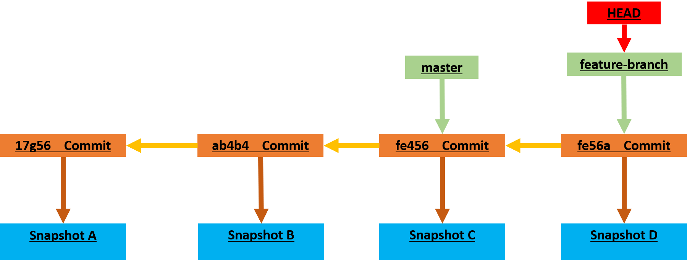
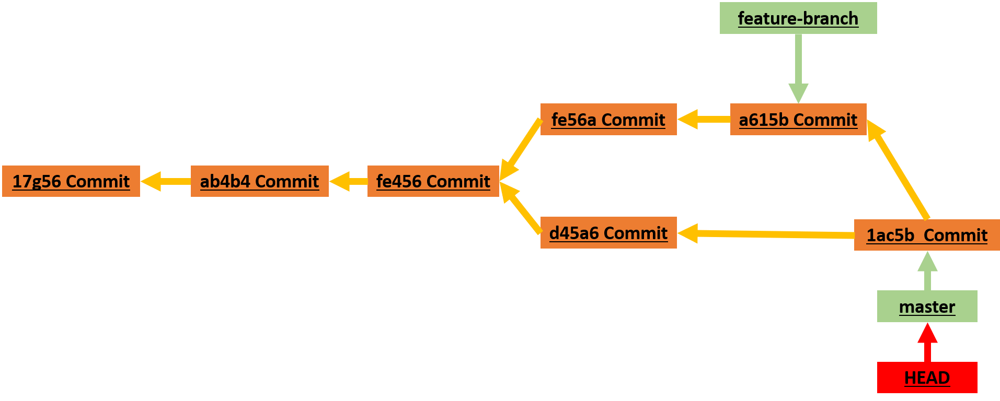

Branching in Git is a powerful feature that allows developers to diverge from the main line of development (usually referred to as the `master` branch) and work on separate, isolated lines of development. Each branch represents an independent line of development, enabling multiple features, fixes, or experiments to be worked on simultaneously without interfering with each other. Branching can be a crucial part of software development, as it allows teams to work collaboratively on different features or fixes simultaneously while maintaining a clear and organized codebase. Isolating work in branches, changing context, and integrating changes into the main line of development can help streamline the development process and improve collaboration.

## **What are Branches?**

A branch in Git is simply a lightweight movable pointer to one commit. The default branch name in Git is master. As you start making commits, you’re given a master branch that points to the last commit you made. Every time you commit, the master branch pointer moves forward automatically. The pointer HEAD tells you where you are in the repository. When you switch branches, HEAD moves to the tip of the new branch.


## **Main Branches**

- **Master Branch:** By convention, the `master` branch is often used to represent the main line of development. It typically contains stable, production-ready code.

- **Main Branch (Post-Git 2.28):** Some projects have adopted renaming the default branch from `master` to `main`. The `main` branch serves the same purpose as the `master` branch, but the naming convention aims to promote more inclusive language.

## **Creating Branches**

- **Creating a New Branch:** To create a new branch, use the `git branch <branch-name>` command. Optionally, you can switch to the new branch immediately with `git checkout -b <branch-name>` or `git switch -c <branch-name>`.


  ```bash
  git branch feature-branch
  ```


- **Switching Branches:** To switch between branches, use the `git checkout <branch-name>` command or `git switch <branch-name>`.

### 1. **`git checkout`**

  ```bash
  git checkout feature-branch
  ```


### 2. **`git switch`**
 Introduced in Git version 2.23, `git switch` is specifically designed for branch switching. It offers a more intuitive and safer way to switch branches compared to `git checkout`.
  
  ```bash
  git switch <branch-name>
  ```

- Both `git switch` and `git checkout` are used for switching branches in Git.
- `git switch` is specifically designed for branch switching and offers a safer and more intuitive experience compared to `git checkout`.
- While `git checkout` remains a versatile command for various Git operations, `git switch` is recommended for branch switching to promote consistency and safety in your workflow.

 git checkout is a multi-purpose tool, capable of switching branches, discarding changes, and even creating new branches. Conversely, git switch is more specialized, focusing solely on switching and creating branches.

## **Viewing Branches**

- **Listing Branches:** To list all branches in the repository, use the `git branch` command.

  ```bash
  git branch
  ```
  An asterisk (`*`) in the output indicates that the branch you are currently on is the currently active branch.

The `git branch -a` command is used to list all branches in a Git repository, including both local branches and remote branches.

```bash
git branch -a
```

- **`git branch`:** This is the Git command used to manage branches in a repository.

- **`-a` (or `--all`):** This option tells Git to list both local branches and remote branches.

When you run `git branch -a`, Git will list all branches in the repository, including:

- **Local Branches:** Branches that exist only in your local repository.
- **Remote Branches:** Branches that exist on the remote repository (e.g., on GitHub, GitLab).
- **Remote Tracking Branches:** Local representations of remote branches, used for tracking changes from the remote repository.

The output typically looks like this:

```plaintext
* main
  feature-branch
  remotes/origin/HEAD -> origin/main
  remotes/origin/main
  remotes/origin/feature-branch
```

- The branches listed without the `remotes/` prefix are local branches.
- The branches listed with the `remotes/` prefix are remote branches.
- `origin` is the default name for the remote repository, but you may see other names if you have multiple remotes configured.

### Useful flags

To display information about branches, you can use the following flags:

- `-v, --verbose`: Displays additional information about each branch, showing the commit message or commit SHA of the last commit on each branch.
- `-vv`: Displays more verbose information about each branch, including tracking information.
- `-l, --list`: Lists branches matching the given pattern.
- `-a, --all`: Lists all branches in the repository, including local and remote branches.
- `-r, --remote`: Lists only remote branches.


To manage branches, you can use the following flags:

- `-d, --delete`: Deletes the specified branch.
- `-D`:  Shortcut for `--delete --force`. Deletes the specified branch forcibly, even if it has unmerged changes.
- `-m, --move`: Renames the specified branch locally.
``` bash
# Rename the branch locally
git branch --move bad-branch-name corrected-branch-name
# Push the branch to the remote repository
git push --set-upstream origin corrected-branch-name
# delete bad branch in the remote repository
git push origin --delete bad-branch-name
```

- `-c, --copy`: Copies the specified branch.

To filter branches, you can use the following flags:

- `--merged`: Lists only branches that have been merged into the current branch.
- `--no-merged`: Lists only branches that have not been merged into the current branch.
- `--contains`: Lists only branches that contain the specified commit.
- `--no-contains`: Lists only branches that do not contain the specified commit.
- `--points-at`: Lists only branches that point at the specified commit.
- `--no-points-at`: Lists only branches that do not point at the specified commit.

--merged and --no-merged will, if not given a commit or branch name as an argument, show you what is, respectively, merged or not merged into your current branch. 
But if you provide an additional argument to ask about the merge state with respect to some other branch without checking that other branch out first, as in, what is not merged into the master branch?

```bash
git branch --no-merged master
```

## **Merging Branches**

Let's do another commit on the `feature-branch` branch. 



We will want eventually to merge this commit into the `main` branch. However, other collaborators are working on the other features (hotfixes) and create another branch for a hotfix.

### Fast-forward merges

To merge changes from one branch into another, use the `git merge <branch-name>` command.

However you have to first checkout to the branch you want to merge into.

```bash
git checkout master
```


```bash
git merge hotfix-branch
```


You’ll notice the phrase “fast-forward” in that merge. Because the commit pointed to by the branch hotfix (d45a6) you merged in was directly ahead of the commit (fe456) you’re on, Git simply moves the pointer forward.  Git simplifies things by moving the pointer forward because there is no divergent work to merge together — this is called a “fast-forward”.


### **Deleting Branches**

Now, that the hotfix branch is no longer needed, we can delete it.
To delete a branch, use the `git branch -d <branch-name>` command.

```bash
git branch -d hotfix-branch
```


### Recursive merge

Now we can switch back to our work-in-progress branch in order to continue working on our project.

```bash
git checkout feature-branch
```
And do more commits on the feature branch.


As you can see, now there is a divergent work to merge. Because the commit on the branch you’re on isn’t a direct ancestor of the branch you’re merging in. To merge merge changes into the master branch, we must first switch to the master branch. then we can merge the feature branch into the master branch.


```bash
git checkout master
```

then 

```bash
git merge feature-branch
```
You will notice the info: Merge made by the 'recursive' strategy.  Git does a simple three-way merge, using the two snapshots pointed to by the branch tips and the common ancestor of the two. Instead of just moving the branch pointer forward, Git creates a new snapshot that results from this three-way merge and automatically creates a new commit that points to it. This is referred to as a merge commit, and is special in that it has more than one parent.



Now that our work is merged in, we have no further need for the feature branch. We can close the issue in the issue-tracking system, and delete the branch:

```bash
git branch -d feature-branch
```

### Merging conflicts

If you changed the same part of the same file differently in the two branches you’re merging, Git won’t be able to merge them cleanly. In this case, you’ll see a merge conflict in the output, and Git will tell you which files you need to resolve the conflict with. Git hasn’t automatically created a new merge commit. It has paused the process while you resolve the conflict. If you want to see which files are unmerged at any point after a merge conflict, you can run git status.

```bash
git status
```
Anything that has merge conflicts and hasn’t been resolved is listed as unmerged. Git adds standard conflict-resolution markers to the files that have conflicts, so you can open them manually and resolve those conflicts.

Merge conflicts are recognized by VS Code. Differences are highlighted and there are inline actions to accept either one or both changes. These inline actions are shown in the editor at the top of the merge conflict. Once the conflicts are resolved, stage the conflicting file so you can commit those changes.


This resolution of the merge conflict needs to be done in Git. The <<<<<<<<<, =======, and >>>>>>> lines need to be completely removed. After you’ve resolved each of these sections in each conflicted file, run git add on each file to mark it as resolved. Staging the file marks it as resolved in Git.

If you want to use a graphical tool to resolve these issues, you can run git mergetool, which fires up an appropriate visual merge tool and walks you through the conflicts. After you exit the merge tool, Git asks you if the merge was successful. If you tell the script that it was, it stages the file to mark it as resolved for you. You can run git status again to verify that all conflicts have been resolved.
If you’re happy with that, and you verify that everything that had conflicts has been staged, you can type git commit to finalize the merge commit. 


## **Branching Strategies**

Git encourages workflows that branch and merge often, even multiple times in a day. Understanding and mastering this feature gives you a powerful and unique tool and can entirely change the way that you develop. The way Git branches is incredibly lightweight, making branching operations nearly instantaneous, and switching back and forth between branches generally just as fast.

- **Feature Branching:** Create a separate branch for each new feature or task. This isolates changes related to specific features, making them easier to manage and review.

- **Release Branching:** Create branches for each release to stabilize the codebase before deployment.

- **Hotfix Branching:** Create branches to fix critical issues in production code quickly.

## **Branching Best Practices**

- **Use Descriptive Names:** Choose meaningful names for branches to indicate their purpose or associated feature.

- **Keep Branches Short-Lived:** Merge branches into the main line of development once their purpose is served to avoid branch clutter.

- **Regularly Update Branches:** Keep branches up-to-date with changes in the main line of development by frequently merging or rebasing.

- **Review Branches:** Encourage code review and collaboration by reviewing changes made in feature branches before merging them.

## **Remote Branches**

- **Pushing a Branch:** To push a local branch to a remote repository, use the `git push <remote-name> <branch-name>` command.

  ```bash
  git push origin feature-branch
  ```

- **Tracking Remote Branches:** After pushing a branch to the remote repository, it can be tracked. This means Git remembers the relationship between the local branch and its corresponding remote branch.

  ```bash
  git checkout -b feature-branch origin/feature-branch
  ```

  The `git branch --set-upstream-to` command is used to set up the tracking relationship between a local branch and a remote branch. This command tells Git which remote branch the local branch should track, allowing you to push and pull changes to and from the correct remote branch without specifying it each time. 

```bash
git branch --set-upstream-to=<remote>/<branch>
```

- `<remote>`: The name of the remote repository.
- `<branch>`: The name of the remote branch.


```bash
git branch --set-upstream-to=origin/main
```

This command sets the tracking relationship for the current branch to the specified remote branch (`main` in this example) in the `origin` remote repository.
After running this command, Git knows that when you push or pull changes from the current branch, it should interact with the `main` branch in the `origin` remote repository.

**Syncing Changes** After setting up tracking, you can simply use `git push` and `git pull` without specifying the remote branch, as Git already knows where to push and pull changes from.

- This command can also be used in combination with `git push -u` or `git push --set-upstream` to set up tracking and push changes to the remote branch in one step.

## **Rebasing**

In Git, there are two main ways to integrate changes from one branch into another: the merge and the rebase.

### The Basic Rebase

The merge command performs a three-way merge between the two latest branch snapshots (d45a6 and a615b) and the most recent common ancestor of the two (fe456), creating a new snapshot (and commit 1ac5b).


However, there is another way: you can take the patch of the change that was introduced in a615b and reapply it on top of d45a6. In Git, this is called rebasing. With the rebase command, you can take all the changes that were committed on one branch and replay them on a different branch. 

This operation works by going to the common ancestor of the two branches (the one you’re on and the one you’re rebasing onto), getting the diff introduced by each commit of the branch you’re on, saving those diffs to temporary files, resetting the current branch to the same commit as the branch you are rebasing onto, and finally applying each change in turn.

``` bash
git checkout feature-branch
git rebase master
```


At this point, you can go back to the master branch and do a fast-forward merge.

``` bash
git checkout master
git merge feature-branch
```


Rebasing makes for a cleaner history. If you examine the log of a rebased branch, it looks like a linear history: it appears that all the work happened in series, even when it originally happened in parallel.


### **--onto flag**

The `--onto` flag in the `git rebase` command is used to specify a new base (or starting point) for the rebase operation. This flag allows you to reapply a series of commits onto a different branch or commit, effectively changing the parent of the commits being rebased.

```
git rebase --onto <new_base> <old_base> <branch>
```

- `<new_base>`: Specifies the new base commit or branch where you want the series of commits to be reapplied.
- `<old_base>`: Specifies the original base commit or branch from which the series of commits should be moved.
- `<branch>`: Specifies the branch containing the commits you want to rebase.

**Steps:**

1. **Identify the Commits to Rebase:** The rebase operation will take the commits from `<old_base>` up to (but not including) the current branch's tip.

2. **Detach the Commits:** The commits to be rebased are temporarily detached from their original base.

3. **Apply the Commits to the New Base:** The detached commits are then applied one by one on top of the `<new_base>`.

4. **Reattach the Branch:** Finally, the branch pointer is moved to the last commit that was applied, completing the rebase operation.

**Use Cases:**

- **Restructuring Commit History:** You can use `--onto` to move a series of commits from one branch to another, effectively restructuring the commit history.
- **Creating Feature Branches:** If you started working on a feature branch from the wrong starting point, you can use `--onto` to rebase your changes onto the correct branch or commit.

**Example:**

Suppose you have the following commit history:

```
          A -- B -- C (feature)
         /
... -- X -- Y -- Z (master)
```

To move commits `B` and `C` from the `feature` branch onto `master`, you can use:

```bash
git rebase --onto master feature~2 feature
```

After the rebase, the commit history would look like:

```
              B' -- C' (feature)
             /
... -- X -- Y -- Z -- A -- B -- C (master)
```

In this example, `B'` and `C'` represent the rebased commits on the `feature` branch, applied on top of the `master` branch. The original `B` and `C` commits are effectively moved onto the `master` branch.

**Notes:**

- Always exercise caution when using `git rebase`, especially with `--onto`, as it rewrites commit history.

- Make sure you understand the implications of rebasing and its potential impact on collaboration and shared branches.

- Do not rebase commits that exist outside your repository and that people may have based work on. When you rebase stuff, you’re abandoning existing commits and creating new ones that are similar but different. If you push commits somewhere and others pull them down and base work on them, and then you rewrite those commits with git rebase and push them up again, your collaborators will have to re-merge their work and things will get messy when you try to pull their work back into yours.