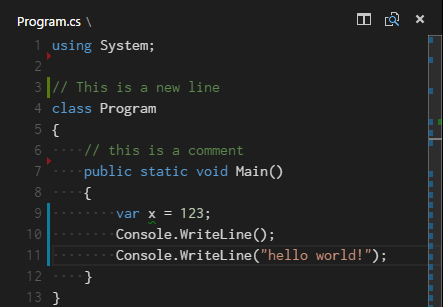

In Git, several commands allow inspection and comparison of changes, commits, branches, and repository states. 

## **git status**

Shows the status of the working directory and staging area.

  ```bash
  git status
  ```
 Quickly check which files are modified, staged, or untracked.

In VS Code, selecting a file in the Source Control panel will open a diff view of the changes introduced by that file. There is a Synchronize Changes action in the Status Bar, next to the branch indicator, when the current checked out branch has an upstream branch configured. Synchronize Changes will pull remote changes down to your local repository and then push local commits to the upstream branch. If there is no upstream branch configured and the Git repository has remotes set up, the Publish action is enabled. This will let you publish the current branch to a remote.

### Gutter indicators

If you open a folder that is a Git repository and begin making changes, VS Code will add useful annotations to the gutter and to the overview ruler.

+ A red triangle indicates where lines have been deleted
+ A green bar indicates new added lines
+ A blue bar indicates modified lines




## **git diff**

 Displays the differences between changes in the working directory and the staging area.

  ```bash
  git diff
  ```
 Review modifications before staging them or to see changes that haven't been staged yet.

### **git diff \{commit\} \{commit\}**

 Shows the differences between two commits.

  ```bash
  git diff abc123 def456
  ```
 Compare the changes between specific commits.

### **git diff \{branch1\} \{branch2\}**

 Shows the differences between two branches.

  ```bash
  git diff main feature-branch
  ```
 Compare changes between different branches.

### Timeline view

The Timeline view, accessible at the bottom of the File Explorer by default, is a unified view for visualizing time-series events (for example, Git commits) for a file.


VS Code's built-in Git support provides the Git commit history of the specified file. Selecting a commit will open a diff view of the changes introduced by that commit. When you right-click on a commit, you'll get options to Copy Commit ID and Copy Commit Message.

## **git log**

 Displays the commit history.

  ```bash
  git log
  ```
 Review the commit history, including commit messages, authors, dates, and commit hashes. By default, with no arguments, git log lists the commits made in that repository in reverse chronological order; that is, the most recent commits show up first

### **git log --graph --oneline**

 Shows a compact view of the commit history with a graph.

  ```bash
  git log --graph --oneline
  ```
 Visualize the branching and merging history of the repository.

### **git log \{file\}**

 Displays the commit history for a specific file.

  ```bash
  git log file.txt
  ```
 Review the commit history for a particular file, including changes made to it over time.

### **git log branchB..branchA**

 Shows the commits on branchA that are not on branchB.

  ```bash
  git log branchB..branchA
  ```
 Identify the commits unique to one branch compared to another, useful for understanding divergent development paths.

### **git log --follow \[file\]**

 Shows the commits that changed the specified file, even across renames.

  ```bash
  git log --follow file.txt
  ```
 Track the history of changes for a specific file, even if it was renamed in subsequent commits.

### **git log --patch**

Shows the commit history in a unified diff format. One of the more helpful options is -p or --patch, which shows the difference (the patch output) introduced in each commit. You can also limit the number of log entries displayed, such as using -2 to show only the last two entries.

```bash
git log -p -2
```
### **git log --stat**

Shows the commit history in a more readable format.

```bash
git log --stat -M
```
The --stat option prints below each commit entry a list of modified files, how many files were changed, and how many lines in those files were added and removed. It also puts a summary of the information at the end.

This command is used to display the commit history along with statistics about the changes introduced in each commit, including information about file modifications, additions, and deletions. The `-M` option is particularly used to detect file renames.

- `git log`: Displays the commit logs.
- `--stat`: Includes additional statistics at the end of each commit entry, providing a summary of changes.
- `-M`: Enables Git's rename detection, which identifies file renames between commits.

```bash
git log --stat -M
```

This command will output a detailed log that includes commit information and statistics. The statistics section shows the number of lines added and removed for each file affected by the commit. Additionally, if a file has been renamed, Git will provide information about the rename.

Here is a simplified example of what the output might look like:

```
commit abcd1234 (HEAD)
Author: John Doe <john.doe@example.com>
Date:   Tue Jan 18 12:00:00 2024 +0000

    Updated README.md

 README.md | 10 +++++-----
 1 file changed, 5 insertions(+), 5 deletions(-)
```

In this example:

- `commit abcd1234`: The unique identifier of the commit.
- `Author`: The author of the commit.
- `Date`: The date and time of the commit.
- `Updated README.md`: The commit message.

The statistics section (`README.md | 10 +++++-----`) indicates that in the file `README.md`, 10 lines were added, and 5 lines were removed. This section provides a quick overview of the changes made in each commit.

The `-M` option enhances this by detecting file renames. If a file has been renamed, Git will track the rename and display the old and new filenames.

- The `-M` option can take an optional value to set a similarity index for rename detection. For example, `-M90%` would consider files as renamed if 90% of their content is similar.
- Using `-M` can be especially useful when you want to track the history of a file that has been renamed over time.


### Limit the output of git log

|Option|	Description|
| --- | --- |
|-<n\>|Show only the last n commits.|
|--since, --after|Limit the commits to those made after the specified date.|
|--until, --before|Limit the commits to those made before the specified date.|
|--author|Only show commits in which the author entry matches the specified string.|
|--committer|Only show commits in which the committer entry matches the specified string.|
|--grep|Only show commits with a commit message containing the string.|
|-S|Only show commits adding or removing code matching the string.|


```bash
git log --pretty="%h - %s" --author='Junio C Hamano' --since="2008-10-01" --before="2008-11-01" --no-merges -- t/
```

This `git log` command is used to display a filtered and formatted list of commits from the Git repository. 

1. **`git log`:**
This is the main Git command for viewing commit history.

2. **`--pretty="%h - %s"`:**
The `--pretty` option specifies the output format for each commit. In this case, `%h` represents the abbreviated commit hash and `%s` represents the commit subject. The format string `%h - %s` prints the abbreviated commit hash followed by the commit subject.

3. **`--author='Junio C Hamano'`:**
The `--author` option filters the commits based on the author's name. Only commits authored by "Junio C Hamano" will be included in the output.

4. **`--since="2008-10-01"`:**
The `--since` option specifies the start date for filtering commits. Only commits made after October 1st, 2008, will be included in the output.

5. **`--before="2008-11-01"`:**
The `--before` option specifies the end date for filtering commits. Only commits made before November 1st, 2008, will be included in the output.

6. **`--no-merges`:**
The `--no-merges` option excludes merge commits from the output. Only non-merge commits will be displayed.

7. **`-- t/`:**
This specifies the pathspec, which limits the commits to those that affect files or directories under the `t/` directory.


## **git show \{commit\}**

 Displays the details of a specific commit.

  ```bash
  git show abc123
  ```
 View the changes introduced by a commit and its metadata.

## **git branch**

 Lists all local branches.

  ```bash
  git branch
  ```
 Check the available branches and see the current branch.

### **git branch -a**

 Lists all local and remote branches.

  ```bash
  git branch -a
  ```
 View all branches, including those from remote repositories.


These Git commands for inspection and comparison are invaluable for understanding the state of the repository, tracking changes, reviewing history, and identifying differences between branches or commits. Incorporating these commands into your Git workflow can enhance your ability to manage and collaborate on projects effectively.