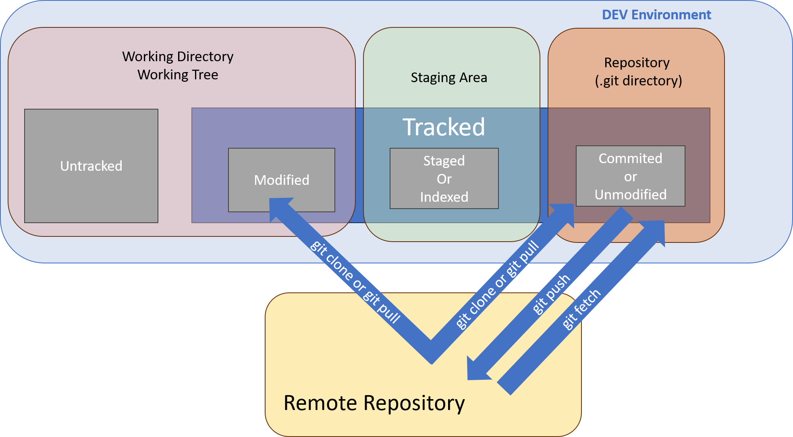

**SHARE & UPDATE**

Retrieving updates from another repository and updating local repos.

Working with remotes in Git involves collaborating with repositories hosted on remote servers. 



## **Viewing Remote Information**

To see which remote servers you have configured, run the following command:

```bash
git remote -v
```

Displays the URLs of the remote repositories.  It lists the shortnames of each remote handle you’ve specified. If you’ve cloned your repository, you should at least see origin — that is the default name Git gives to the server you cloned from. The -v flag displays the full remote URLs.
When you have multiple remotes then you can pull contributions from any of these remotes.

## **Adding a Remote**

Here’s how to add a new remote explicitly.

```bash
git remote add <remote-name> <remote-url>
```
```bash
git remote add origin https://github.com/user/repo.git
```
Adds a remote repository with a given name and URL. Now you can use the string origin on the command line in lieu of the whole URL. For example, if you want to fetch all the information from the remote repository, you can use:

```bash
git fetch origin
```

## **Fetching Changes from a Remote**

The command goes out to that remote project and pulls down all the data from that remote project that you don’t have yet. After you do this, you should have references to all the branches from that remote, which you can merge in or inspect at any time.

```bash
git fetch <remote-name>
```
```bash
git fetch origin
```
Fetches changes from all branches in the remote repository but does not merge them into the local branch.


```bash
git fetch <remote-name> <branch-name>
```
```bash
git fetch origin main
```
Fetches changes from the main branch in the remote repository and merges them into the local branch.

## **Pulling Changes from a Remote**

```bash
git pull <remote-name> <branch-name>
```
```bash
git pull origin main
```
Fetches changes from the remote repository and merges them into the local branch.

From Git version 2.27 onward, git pull will give a warning if the pull.rebase variable is not set. Git will keep warning you until you set the variable.

If you want the default behavior of Git (fast-forward if possible, else create a merge commit): 
```bash
git config --global pull.rebase "false"
```
If you want to rebase when pulling: 
```bash
git config --global pull.rebase "true"
```
## **Pushing Changes to a Remote**

When you have your project at a point that you want to share, you have to push it upstream. The command for this is simple.

```bash
git push <remote-name> <branch-name>
```

```bash
git push origin main
```

Pushes local commits to the remote repository. This command works only if you cloned from a server to which you have write access and if nobody has pushed in the meantime. If you and someone else clone at the same time and they push upstream and then you push upstream, your push will rightly be rejected. You’ll have to fetch their work first and incorporate it into yours before you’ll be allowed to push.


## **Creating a Branch in a Remote Repository**

```bash
git push <remote-name> <local-branch-name>:<remote-branch-name>
```

```bash
git push origin feature-branch:feature-branch
```
Creates a new branch in the remote repository based on the local branch.

## **Cloning a Repository**

```bash
git clone <remote-url>
```

```bash
git clone https://github.com/user/repo.git
```

Creates a local copy of a remote repository.

## **Renaming a Remote**


```bash
git remote rename <old-name> <new-name>
```

```bash
git remote rename origin upstream
```

Renames an existing remote.

## **Removing a Remote**

```bash
git remote remove <remote-name>
```
```bash
git remote remove origin
```

Removes a remote from the list of remotes.

## **Inspecting Remote Branches**

```bash
git branch -r
```

Lists remote branches.

The `git remote show` command is used to display information about a specific remote repository. It provides details such as the URL of the remote repository, the branches it tracks, and additional information about the remote branches.

```bash
git remote show <remote-name>
```

```bash
git remote show origin
```
The output of `git remote show <remote-name>` typically includes the following information:

1. **Remote URL:** The URL of the remote repository.

2. **Fetch URL:** The URL used by `git fetch` to fetch from the remote repository. This may differ from the remote URL if the repository supports fetching from a different location.

3. **Push URL:** The URL used by `git push` to push to the remote repository. This may differ from the remote URL if the repository supports pushing to a different location.

4. **Remote branches:** Lists the branches present in the remote repository.

5. **Local branch configured for `git pull`:** Indicates the local branch that `git pull` will merge into.

6. **Local refs configured for `git push`:** Indicates the local branch that `git push` will push to.

7. **Tracking information for each branch:** Shows information about the local branch's relationship with the remote branches. This includes the branch name, the remote branch it tracks, whether it is up to date, and the number of commits behind or ahead.


```plaintext
* remote origin
  Fetch URL: https://github.com/user/repo.git
  Push  URL: https://github.com/user/repo.git
  HEAD branch: main
  Remote branches:
    main    tracked
    feature tracked
  Local branch configured for 'git pull':
    main merges with remote main
  Local refs configured for 'git push':
    main    pushes to main    (up to date)
    feature pushes to feature (local out of date)
```

- The `git remote show` command is useful for inspecting the configuration and status of a remote repository.
- It helps in understanding how local branches are synchronized with remote branches.
- The output provides valuable information for managing and coordinating work with remote repositories.

Using `git remote show` can provide insights into the state of your remote repository, aiding in decision-making when performing operations such as fetching, pulling, or pushing changes.
