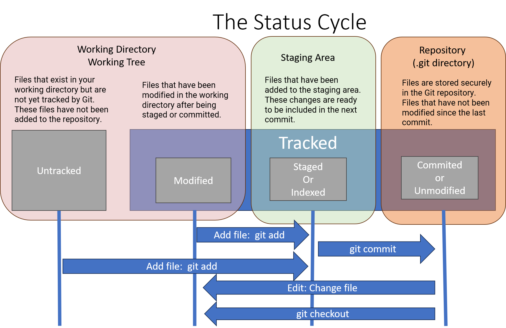
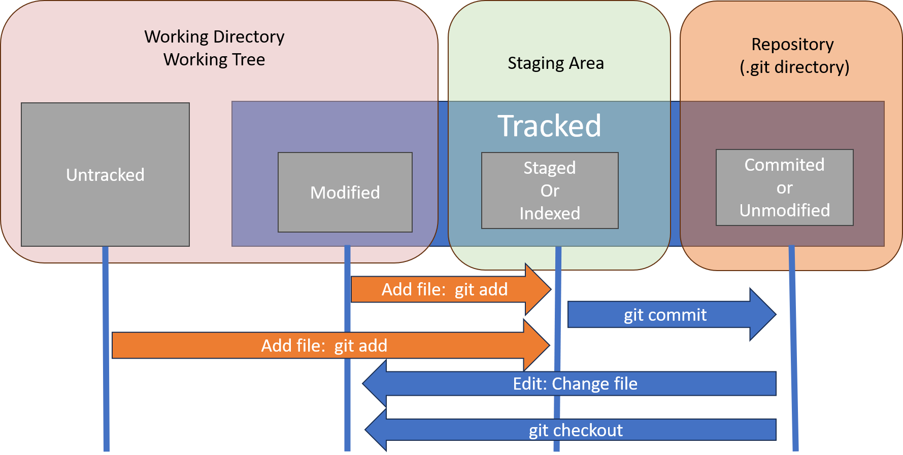

## The Lifecycle of Git files

Understanding the lifecycle of the status of files in Git is crucial for effectively managing changes in your repository. The lifecycle consists of several stages that files can transition through as you work with Git. These stages are reflected in the output of `git status` and represent the state of files in relation to the repository. 

- **Transition between Stages:** Files transition between these stages as you work with Git commands like `git add`, `git commit`, and others.
- **Workflow:** The typical workflow involves modifying files in the working directory, staging the changes with `git add`, and committing the changes with `git commit`.
- **Visibility:** Use `git status` to view the current status of files in your repository and identify which stage they are in.

| Stage         | Description                 |  Representation                   | Action                       |
|---------------|----------------------------|----------------------|-----------------------------------|
| Untracked     | Files that exist in your working directory but are not yet tracked by Git. These files have not been added to the repository. |Shown in red in the output of `git status`.|Use `git add <file>` to stage untracked files for the next commit. |
| Tracked  (or Modified)     | Files that have been modified in the working directory after being staged or committed. | Shown in red in the output of `git status`.| Use `git add <file>` to stage the modified files, then commit the changes with `git commit`.                               |
|Deleted|Files that have been deleted from the working directory after being staged or committed.|Shown in red in the output of `git status`.|Use `git add <file>` to stage the deletion, then commit the changes with `git commit`.|
|Renamed or Moved| Files that have been renamed or moved in the working directory after being staged or committed.|Shown as both deleted and untracked files in the output of `git status`.|Use `git add <file>` to stage the rename or move, then commit the changes with `git commit`.|
| Staged (or Indexed)        |  Files that have been added to the staging area. These changes are ready to be included in the next commit. |Shown in green in the output of `git status`.| Use `git commit` to create a commit containing the staged changes.   |
| Committed (or Unmodified)    | Files are stored securely in the Git repository. They are unchanged and represent a specific snapshot in the project's history. Files that have not been modified since the last commit. | Typically not displayed in the output of `git status` unless using certain flags.|   No action required unless you intend to stage or modify the files.   |



The **working tree** is a single checkout of one version of the project. These files are pulled out of the compressed database in the Git directory and placed on disk for you to use or modify.

The **staging area** is a file, generally contained in your Git directory, that stores information about what will go into your next commit. 

The **Git directory** is where Git stores the metadata and object database for your project. This is the most important part of Git, and it is what is copied when you clone a repository from another computer.


**Working with snapshots and the Git staging area**

For the basic workflow of staging content and committing it to your history, there are only a few basic commands.

|  Command |  Example |
|:-------------:|:----------------:|
| [git status](#git-status)       |  ``` git status```  |
| [git add](#git-add)        |  ``` git add myfile.txt```  |
| [git diff](#git-diff)        |  ``` git diff```  |
| [git commit](#git-commit)        |  ``` git commit -m "Add new feature"```  |

## Snapshooting
The difference between Git's snapshooting and delta-based version control systems lies in how git store and track changes within a repository.

1. **Git's Snapshooting**
 Git is a distributed version control system (DVCS) that operates based on snapshots of the entire repository at each point in time.
 When a commit is made in Git, the entire state of the project at that moment is captured as a snapshot, including all files and their contents. Each commit creates a new snapshot, and Git tracks the changes between snapshots rather than individual file changes.
    - **Advantages:**
        - Offers robustness and data integrity since each commit is self-contained and immutable.
        - Allows for efficient branching and merging operations since entire snapshots are managed independently.
        - Facilitates offline work and collaboration by enabling users to work with their local repositories and synchronize changes later.

2. **Delta-based Version Control (CVS, Subversion, Perforce)**
 Delta-based version control systems track changes by storing the differences (or deltas) between successive versions of a file or repository.
 Instead of storing complete snapshots of files or repositories, delta-based systems store the changes (insertions, deletions, modifications) made to files over time. Each new version is represented as a set of changes applied to the previous version.
    - **Advantages:**
        - Can be more space-efficient for repositories with large binary files or frequent, small changes since only the differences are stored.
        - Allows for quicker network operations when transmitting changes since only the deltas need to be transferred.
        - May provide more granular control over individual file versions, especially for large files with small modifications.

**Key Differences**

+ **Granularity:** Git's snapshot-based approach captures the entire state of the repository at each commit, offering a holistic view of the project's history. Delta-based systems track changes at a finer granularity, focusing on individual file modifications.

+ **Efficiency:** Git's approach can be less space-efficient for repositories with frequent changes or large binary files since it stores complete snapshots. Delta-based systems may offer better efficiency in such cases by only storing the differences between versions.

+ **Complexity:** Managing deltas and applying them to reconstruct files can introduce complexity and potential performance overhead in delta-based systems. Git's snapshot-based approach simplifies operations like branching and merging since each commit represents a complete, self-contained snapshot.

+ **Network Operations:** Git's approach may lead to larger repository sizes due to storing complete snapshots, but it offers efficient network operations since it transfers complete commits during push and pull operations. Delta-based systems may have smaller repository sizes but may require more processing to reconstruct files during network operations.

Overall, Git's snapshot-based approach provides robustness, simplicity, and efficiency for version control, making it a popular choice for software development projects of all sizes. Delta-based version control systems offer advantages in specific use cases where space efficiency or granular control over individual file versions is paramount.


### git status

Shows the status of your working directory, indicating which files are modified, untracked, and staged for the next commit.
```bash
git status
```

This command provides a detailed summary of the changes in your working directory. Files listed under "Changes not staged for commit" are modified but not staged, and files under "Changes to be committed" are staged for the next commit.

### git add



Adds changes in the specified file to the staging area, preparing them for the next commit.

```bash
# Create or modify a file
echo "Hello, Git!" > myfile.txt

# Stage the changes
git add myfile.txt
```

This sequence of commands creates or modifies `myfile.txt` and stages the changes for the next commit.

Use `git add .` to stage all changes in the working directory.


### git diff

The git diff command is used when you want to see differences between any two trees. This could be the difference between your working environment and your staging area (git diff by itself), between your staging area and your last commit (git diff --staged), or between two commits (git diff master branchB).


```bash
# Make changes to myfile.txt
echo "Updated content" >> myfile.txt

# View the differences
git diff
```

This command displays the unstaged changes in `myfile.txt` since the last commit.

#### git diff --staged

Shows the differences between the staging area and the last commit (changes that are staged but not yet committed).

```bash
# Stage the changes in myfile.txt
git add myfile.txt

# View the differences in the staging area
git diff --staged
```

This command displays the changes that are currently staged for the next commit.

#### git difftool
The git difftool command simply launches an external tool to show you the difference between two trees in case you want to use something other than the built in git diff command.

### git commit 

The `git commit` command in Git is a powerful tool for creating and committing changes. It has several options, each affecting different parts of the Git repository.

```bash
git commit
```
When you run `git commit` without any arguments, it opens your editor of choice to create a commit message.

You can see that the default commit message contains the latest output of the git status command commented out and one empty line on top. You can remove these comments and type your commit message, or you can leave them there to help you remember what you’re committing.
When you exit the editor, Git creates your commit with that commit message (with the comments and diff stripped out).


Alternatively, you can type your commit message inline with the commit command by specifying it after a -m flag. This commits the changes that are staged in the snapshot, with a descriptive commit message.

```bash
# Commit the changes with a message
git commit -m "Add new feature"
```

This command creates a new commit with the staged changes and the specified commit message.

- Combine `git add` and `git commit` in one step using `git commit -am "[descriptive message]"` to stage and commit changes.

For an even more explicit reminder of what you’ve modified, you can pass the -v option to git commit. Doing so also puts the diff of your change in the editor so you can see exactly what changes you’re committing.

#### Committing Specific Files

```bash
# Stage changes in specific files
git add file1.txt file2.txt

# Commit the changes with a message
git commit -m "Fix issues in file1.txt and file2.txt"
```

Here, only specific files (`file1.txt` and `file2.txt`) are staged and then committed with a message describing the fix.

#### Amending the Last Commit

```bash
# Make additional changes
echo "Additional content" >> myfile.txt

# Amend the last commit with new changes
git add myfile.txt
git commit --amend -m "Update myfile.txt with additional content"
```

This example adds new content to `myfile.txt` and then amends the last commit with the additional changes.

#### [Interactive Commit](../Advanced/git_interactivestaging.md)
```bash
# Interactively stage changes
git add -i

# Follow the interactive prompts to stage changes and commit
```

Running `git add -i` opens an interactive mode where you can choose which changes to stage, unstage, or commit. This provides a more granular control over the commit process.

#### Committing with Multiple Messages

```bash
# Stage changes in files
git add file1.txt file2.txt

# Commit changes with multiple messages
git commit -m "Fix issues in file1.txt" -m "Add new feature in file2.txt"
```

You can use the `-m` option multiple times to provide multiple commit messages. Each `-m` adds a new paragraph to the commit message.

#### Committing with a Future Date

```bash
# Stage changes
git add .

# Commit with a future date
git commit --date="2023-01-01T12:00:00" -m "Commit with a future date"
```

This example commits changes with a specified future date using the `--date` option.

#### Committing Only Tracked Changes

```bash
# Stage changes in tracked files
git add -u

# Commit only tracked changes
git commit -m "Commit tracked changes"
```

The `git add -u` command stages only tracked files, and then a commit is made with a message indicating the commit of tracked changes.
