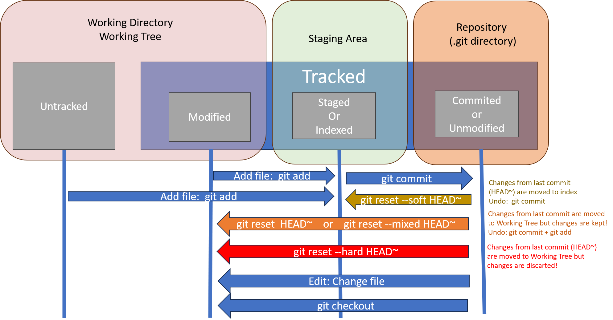
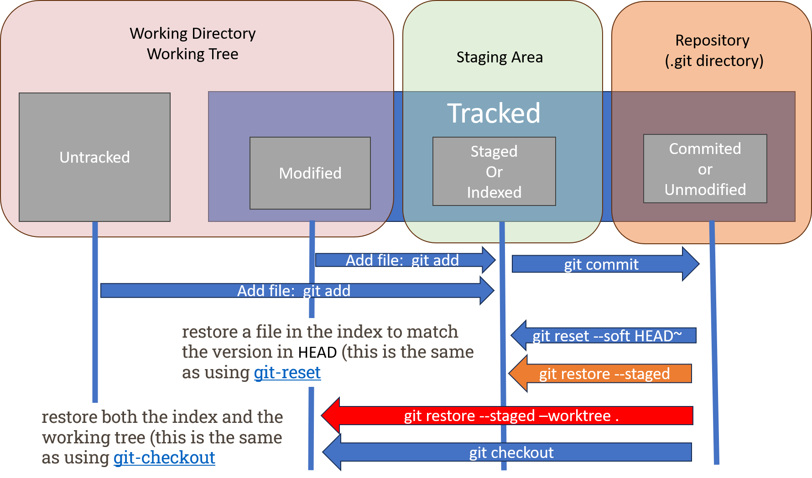

Undoing changes in Git involves various commands and strategies, depending on the nature of the changes and the stage at which they are. Here is a comprehensive guide on common Git undo commands and strategies:

## Summary table 
of common Git undo commands and strategies:

| Action                                    | Command                                                     | Description                                                                                                                                                               |
|-------------------------------------------|-------------------------------------------------------------|---------------------------------------------------------------------------------------------------------------------------------------------------------------------------|
|[**Undoing Commits**](#1-undoing-commits)             | [`git commit --amend`](#amend-the-last-commit)                                        | Amend the last commit by adding new changes or modifying the commit message.                                                                                                |
|                      | [`git revert <commit-hash>`](#reverting-commits)                                  | Create a new commit that undoes changes introduced by a specific commit.                                                                                                   |
|     | [`git rebase -i <commit-hash>`](#interactively-reverting-or-editing-commits)                               | Open an interactive rebase session, allowing you to edit, squash, or drop commits.                                                                                           |
| [**Undoing Uncommitted Changes**](#2-undoing-uncommitted-changes)            | [`git checkout -- file.txt`](#discard-changes-in-a-file)                                  | Discard changes in a specific file, reverting it to the state in the last commit.                                                                                          |
|                                           | [`git reset --hard`](#discard-all-changes)                                          | Discard all uncommitted changes, reverting the working directory to the state of the last commit.                                                                          |
| [**Undoing Staged Changes**](#3-undoing-staged-changes)                 | [`git reset file.txt`](#git-reset-filetxt)                                        | Unstage changes in a specific file, moving them back to the working directory.                                                                                             |
|                    | [`git reset --soft HEAD^`](#git-reset---soft-commit)                                    | Undo the last commit, keeping changes staged in the working directory.                                                                                                     |
|                                           | [`git reset --mixed HEAD^`](#git-reset---mixed-commit)                                   | Undo the last commit, unstaging changes but keeping them in the working directory.                                                                                         |
|                                           | [`git reset --hard HEAD^`](#git-reset---hard-commit)                                    | Undo the last commit, discarding changes both in the commit and the working directory.                                                                                     |
| [**Undoing Remote Changes**](#4-undoing-remote-changes)                 | `git push --force origin <branch-name>`                     | Force push local changes to a remote branch (use with caution, as it rewrites remote history).                                                                             |
| [**Restoring Files**](#5-restoring-files)                       | [`git restore file.txt`](#discard-uncommitted-changes-in-a-file)                                      | Restore the specified file to the state in the last commit (introduced in Git 2.23).                                                                                        |
| [**Rewriting history**](#6-rewriting-history)                       | [`git rebase main`](#git-rebase-branch)                                      | Apply any commits of the current branch ahead of the specified one.                                                                                        |
||[`git filter-branch`](#git-filter-branch)|Rewrite branches to remove unwanted data|
|[**Removing files**](#7-removing-files)|[`git rm`](#git-rm)| Remove files|
||[`git mv`](#git-mv)| Rename files|
||[`git checkout -f [branch]`](#git-checkout--f)|Switch branches, discarding any local changes|
||[`git clean -ffd`](#git-clean--ffd)|Erase all untracked files and directories in the working directory|

Please note that some commands, like force push and hard reset, should be used with caution, especially when collaborating with others, as they can alter Git history. Always be mindful of the consequences and potential impacts on collaborators before executing these commands.

### 1. **Undoing Commits**

`git commit --amend`, and `git revert` are all Git commands used to manipulate commit history, but they serve different purposes and are used in different scenarios.

##### **Amend the Last Commit**

```bash
git commit --amend
```
`git commit --amend` is used to modify the most recent commit by adding or changing files or the commit message. It allows you to make corrections to the most recent commit before pushing it to the remote repository. Use `git commit --amend` when you want to make minor adjustments to the most recent commit, such as fixing typos in the commit message or adding files that were forgotten to be included. Only amend commits that are still local and have not been pushed somewhere. Amending previously pushed commits and force pushing the branch will cause problems for your collaborators.

##### **Reverting Commits**

  ```bash
  git revert <commit-hash>
  ```

  This command creates a new commit that undoes the changes introduced by a specific commit.


`git revert` is used to undo the changes introduced by a specific commit by creating a new commit that undoes those changes. It's a safe way to undo commits without altering the commit history. Use `git revert` when you want to undo the changes introduced by a particular commit while preserving the commit history. It's useful for reverting changes that have already been shared with others or pushed to a remote repository.

##### **Interactively Reverting or Editing Commits**

  ```bash
  git rebase -i <commit-hash>
  ```

This command opens an interactive rebase session, allowing you to edit, squash, or drop commits.
The `git rebase -i HEAD~6` command initiates an interactive rebase for the last six commits starting from the current `HEAD`. This allows you to modify, reorder, squash, or drop commits interactively before applying them onto a new base commit.

Let's break down the components of this command:

- `git rebase`: The main command for reorganizing or combining commits.
- `-i`: Stands for "interactive," which opens an interactive rebase session.
- `HEAD~6`: Specifies the commit range to rebase. In this case, it's the last six commits from the current `HEAD`.

```bash
git rebase -i HEAD~6
```

This command opens a text editor with a list of the last six commits in your default branch. The list might look something like this:

```bash
pick abc123 Commit message 1
pick def456 Commit message 2
pick 789ghi Commit message 3
pick jkl012 Commit message 4
pick mno345 Commit message 5
pick pqr678 Commit message 6
```

In the interactive rebase editor, you can choose actions for each commit:

- `pick`: Keep the commit as is.
- `reword`: Change the commit message.
- `edit`: Pause for amending the commit.
- `squash` or `fixup`: Combine the commit with the previous one.
- `drop`: Remove the commit.

For example, to squash the last three commits into a single commit, you can modify the file to look like this:

```bash
pick abc123 Commit message 1
pick def456 Commit message 2
squash 789ghi Commit message 3
squash jkl012 Commit message 4
squash mno345 Commit message 5
pick pqr678 Commit message 6
```

After saving and closing the file, Git will prompt you to modify the commit message for the new squashed commit.

- Interactive rebasing allows you to create a cleaner and more organized commit history.
- Use `edit` to pause at a specific commit and make changes (e.g., amend, add files, or reword the commit message).
- Always make sure to review and understand the changes you're making during an interactive rebase, as it rewrites commit history.

Interactive rebasing is a powerful but potentially risky operation. Be cautious and ensure you have a backup or a way to recover your changes if needed.


### 2. **Undoing Uncommitted Changes**

##### **Discard Changes in a File**
  ```bash
  git checkout -- file.txt
  ```

  This command discards changes in the specified file, reverting it to the state in the last commit. It’s important to understand that `git checkout -- <file>` is a dangerous command. Any local changes you made to that file are gone — Git just replaced that file with the last staged or committed version. Don’t ever use this command unless you absolutely know that you don’t want those unsaved local changes.

##### **Discard All Changes**
  ```bash
  git reset --hard
  ```

  This command discards all uncommitted changes in the working directory, reverting it to the state of the last commit.

For more details on the difference between git reset and git checkout, see the [differences](#git-reset-vs-git-checkout).

### 3. **Undoing Staged Changes**



 The `git reset` command in Git is a powerful tool for manipulating the commit history, moving branches, and resetting the staging area. It has several options, each affecting different parts of the Git repository. 

#### **git reset --soft <commit\>**

Resets the current branch's HEAD to the specified commit, leaving the changes staged.
Moves the HEAD pointer to the specified commit, keeping the changes from commits after that commit staged for a new commit.

```bash
git reset --soft HEAD~3
```
This command resets the current branch's HEAD to three commits behind the current position, keeping the changes staged. It essentially undid the last 3 git commit commands.You could now update the index (by adding or removing files) and run git commit again to accomplish what git commit --amend would have done.

#### **git reset --mixed <commit\>**
Resets the current branch's HEAD to the specified commit, unstaging the changes. This is also the default, so if you specify no option at all (just git reset HEAD~3 in this case).
Moves the HEAD pointer to the specified commit, unstaging the changes from commits after that commit.

```bash
git reset --mixed HEAD~3
```
This command resets the current branch's HEAD to three commits behind the current position, unstaging the changes.  You rolled back to before you ran all your git add and git commit commands.

#### **git reset --hard <commit\>**
Resets the current branch's HEAD to the specified commit, discarding all changes.
Moves the HEAD pointer to the specified commit, discarding all changes made after that commit.

```bash
git reset --hard HEAD~3
```
This command resets the current branch's HEAD to three commits behind the current position, discarding all changes. Use when you want to completely replace the current branch with the specified commit by discarding all changes made after that commit.

Remember to use `git reset` with caution, especially the `--hard` option, as it can lead to irreversible data loss. Always make sure you understand the consequences of the reset operation before executing it.

#### **git reset file.txt**
The command git reset with a path to a file (since a commit SHA-1 or branch is not specified) is shorthand for git reset --mixed HEAD file.txt. It will:

1. Move the branch HEAD points to (skipped).

2. Make the index look like HEAD (stop here).

So it essentially just copies file.txt from HEAD to the index. This has the practical effect of unstaging the file. If we look at the diagram for that command and think about what git add does, they are exact opposites. This is why the output of the git status command suggests that you run this to unstage a file. 

We could just as easily not let Git assume we meant “pull the data from HEAD” by specifying a specific commit to pull that file version from. We would just run something like:
```	bash
git reset eb43bf file.txt
```

#### git reset vs git checkout

##### Without Paths
Running git checkout [branch] is pretty similar to running git reset --hard [branch] in that it updates all three trees for you to look like [branch], but there are two important differences.

1. Unlike git reset --hard, git checkout is working-directory safe.  It tries to do a trivial merge in the  working directory, so all of the files you haven’t changed will be updated. git reset --hard, on the other hand, will simply replace everything across the board without checking.

2. git checkout will move HEAD itself to point to another branch or commit, while git reset will move the branch that HEAD points to. That is why when using git checkout you may end up with a detached HEAD, which is not possible with git reset. 

##### With Paths 

The other way to run checkout is with a file path, which, like reset, does not move HEAD. It is just like git reset [branch] file in that it updates the index with that file at that commit, but it also overwrites the file in the working directory. It would be exactly like git reset --hard [branch] file (if reset would let you run that) — it’s not working-directory safe, and it does not move HEAD.

#### Cheat-sheet 

This table shows a cheat-sheet for which commands affect which trees. The “HEAD” column reads “REF” if that command moves the reference (branch) that HEAD points to, and “HEAD” if it moves HEAD itself. Pay especial attention to the 'WD Safe?' column — if it says NO, take a second to think before running that command.

||HEAD|	Index|	Workdir|	WD Safe?|
|---|---|---|---|---|
|Commit Level|||||
|reset --soft [commit]|REF|NO|NO|YES|
|reset [commit]|REF|YES|NO|YES|
|reset --hard [commit]|REF|YES|YES|NO|
|checkout <commit>|HEAD|YES|YES|YES|
|File Level|||||
|reset [commit] <paths>|NO|YES|NO|YES|
|checkout [commit] <paths>|NO|YES|YES|NO|


### 4. **Undoing Remote Changes**

- **Force Push to Remote (use with caution)**
  ```bash
  git push --force origin <branch-name>
  ```

  Use this command to force push local changes to a remote branch. **Be cautious** as it rewrites the remote history.

### 5. **Restoring Files**
The `git restore` command is a versatile command introduced in Git version 2.23. It is designed to restore parts of the working directory or discard changes in a way that is more explicit and flexible than some of the previous commands.


#### **`git reset` VS `git restore`**

`git reset` and `git restore` are both Git commands that deal with modifying the working directory, staging area, and commit history, but they serve slightly different purposes. 

| Feature        | git reset                                            | git restore                                             |
|----------------|------------------------------------------------------|---------------------------------------------------------|
| Purpose        | Resets the state of the repository, moving the HEAD pointer to a different commit or updating the staging area and working directory. | Restores files in the working directory to a specified state, either from the index or a commit. Designed for restoring files, either discarding changes or moving them between the working directory and staging area. |
| Syntax         | `git reset [--soft | --mixed | --hard] [<commit>]` | `git restore [--source=<commit>] [--staged] [--worktree] <pathspec>…` |
|Unmodifying a Modified File| [`git checkout -- <file>`](#discard-changes-in-a-file) | [`git restore <file>`](#discard-uncommitted-changes-in-a-file) |
|Unstaging a Staged File| [`git reset <file>`](#git-reset-filetxt) | [`git restore --staged  <file>`](#unstaged-changes-in-a-file) |
|Restore Entire Working Directory| [`git reset --hard <commit>`](#git-reset---hard-commit) | [`git restore --source=<commit> --worktree --staged --worktree .`](#restore-entire-working-directory) |




When comparing using `git restore` with `git reset` there are a few key differences to consider:

**Effect on Staging Area and Working Directory:**

**`git reset`:** When using `git reset`, you have the option to reset changes directly in the staging area and/or the working directory. However, resetting changes with `git reset` typically involves moving the HEAD pointer to a different commit, potentially altering the commit history.

**`git restore`:** With `git restore`, you explicitly specify the source of the changes you want to restore to the staging area (`--staged`) and/or the working directory (`--worktree`). This allows for more granular control over which changes are affected, without altering the commit history.

**Granularity:**

**`git reset`:** `git reset` allows you to reset changes at a commit level or a file level. You can choose to reset all changes introduced by the last commit, specific files, or even specific hunks within files.

**`git restore`:** `git restore` allows you to restore changes at a file or directory level. You can restore changes from a specific commit to the staging area and/or the working directory, but it doesn't provide the same level of granularity for selecting individual hunks within files.

**Ease of Use:**

**`git reset`:** While `git reset` can be powerful, it requires a bit more care and understanding, especially when choosing between `--soft`, `--mixed`, or `--hard` reset modes. Choosing the wrong mode can lead to unintended consequences, such as losing changes in the working directory.

**`git restore`:** `git restore` offers a simpler and more explicit way to restore changes to the staging area and/or the working directory. By specifying the source of the changes and the target locations, you can be more confident in the outcome.

In summary, both `git reset` and `git restore` offer a powerful tool for managing changes in the working directory and staging area. They differ in granularity, control, and ease of use. `git reset` offers more options but requires careful consideration of its modes, while `git restore` provides a simpler and more explicit approach for restoring changes. 

##### **Discard Uncommitted Changes in a File**

To discard uncommitted changes in a specific file and restore it to the state in the last commit:

```bash
git restore file.txt
```

This command reverts the changes made to `file.txt` in the working directory, making it identical to the state of the file in the last commit.

##### **Unstaged Changes in a File**

To unstage changes in a file and move them back to the working directory:

```bash
git restore --staged file.txt
```

This command effectively undoes the staging of changes in `file.txt` and puts them back into the working directory. It is similar to `git reset file.txt`, but `git restore` is more explicit in this context.

##### **Restore Entire Working Directory**

To discard all uncommitted changes and restore the entire working directory to the state of the last commit:

```bash
git restore --source=<commit> --worktree --staged --worktree .
```

- `--source=<commit>`: Specifies the commit from which to take the files states.
- `--staged`: Restores all changes to the staging area.
- `--worktree`: Restores all changes to the working directory.

The `git restore` command provides a clearer and more explicit syntax for specific use cases, making it a powerful tool for managing changes in the working directory and staging area. Always use it with care, especially when dealing with commands that modify or discard changes.

```bash
# restore working tree from HEAD content, 
# without touching the index/staging area
git restore .

# restore working tree from master content, 
# without touching the index/staging area
git restore -s master .

```

Both worktree and index could also be restored at the same time (from a tree) when both --staged and --worktree are specified. This overlaps with 'git checkout [tree] [paths]'. Specify the restore location. If neither option is specified, by default the working tree is restored. Specifying --staged will only restore the index. Specifying both restores both.


### 6. **Rewriting history**
In Git, rewriting branches, updating commits, and clearing history are common tasks that allow you to modify the commit history of a repository. These actions can be useful for cleaning up history, organizing commits, or incorporating changes from other branches. 

##### **git rebase [branch]**

 Apply any commits of the current branch ahead of the specified one.

  ```bash
  git rebase main
  ```
 Incorporate changes from another branch (`main` in this example) into the current branch, moving your commits to the tip of the specified branch.

##### **git filter-branch**

 Rewrite branches to remove unwanted data, such as sensitive information or large files.

  ```bash
  git filter-branch --tree-filter 'rm -f passwords.txt' HEAD
  ```
 Filter branch content by applying a specified command to each commit, useful for history rewriting tasks.

### 7. **Removing Files**

Versioning file removes and path changes

|  Command |  Example |
|:-------------:|:----------------:|
| [git rm](#git-rm)        |  ``` git rm file.txt```  |
| [git mv](#git-mv)        |  ``` git mv oldfile.txt newfile.txt```  |
|[git checkout](#git-checkout)| ``` git checkout -f feature-branch```  |
| [git clean](#git-clean)        |  ``` git clean -ffd```  |


##### git rm

Removes files from both your working directory and the staging area. It stages the removal of the specified files, and you need to commit to apply the changes.

```bash
# Remove a file from the staging area and stage the removal
git rm -f file.txt

# Commit the removal
git commit -m "Remove file.txt"
```

This sequence removes `file.txt` from both the staging area and the working directory , and the removal is committed.

Another useful thing you may want to do is to keep the file in your working tree but remove it from your staging area.

```bash
# Remove a file from the staging area
git rm --cached file.txt
```	

You can pass files, directories, and file-glob patterns to the git rm command. That means you can do things such as:
```bash
$ git rm log/\*.log
```

Note the backslash (\) in front of the *. This is necessary because Git does its own filename expansion in addition to your shell’s filename expansion. This command removes all files that have the .log extension in the log/ directory. Or, you can do something like this:

```bash
$ git rm \*~

```

This command removes all files whose names end with a ~.

##### git mv

Renames or moves files in both your working directory and the Git repository. Similar to `git rm`, it stages the rename/move, and you need to commit to apply the changes.

```bash
# Rename a file and stage the change
git mv oldfile.txt newfile.txt

# Commit the rename
git commit -m "Rename oldfile.txt to newfile.txt"
```

This example renames `oldfile.txt` to `newfile.txt`, stages the change, and commits the rename.

- With `git mv`, you can also use it to move files to a different directory, like `git mv file.txt new_directory/`.
- Use `-r` with `git rm` and `git mv` to handle removals or moves recursively in directories.

##### **git checkout**

 When switching branches, proceed even if the index or the working tree differs from HEAD, and even if there are untracked files in the way.
 This command is used to forcefully switch branches, discarding any local changes or untracked files that may prevent the branch switch.

  ```bash
  git checkout -f feature-branch
  ```
- **Note:** Be cautious when using this command, as it will discard any local changes without warning.

##### **git clean**

 Erase all untracked files and directories in the working directory.
 This command is used to clean up the working directory by removing any untracked files or directories that are not under version control.

  ```bash
  git clean -ffd
  ```
- **Note:** The `-f` option is used to force the clean operation, and the `-d` option is used to include untracked directories.

These commands are useful for cleaning up a Git repository before starting fresh or resolving conflicts that prevent branch switching. However, they should be used with caution, as they can permanently delete local changes and untracked files. It's essential to understand the implications of using these commands and ensure that any necessary changes or files are backed up before proceeding.

```bash
# List untracked files that will be removed (dry run)
git clean -n

# Remove untracked files
git clean -f
```

The command (`git clean -n`) is a dry run that shows you what files would be removed. The second command (`git clean -f`) actually removes the untracked files.

- `git clean` has additional options, such as `-i` for an interactive mode where you can choose which files to clean.