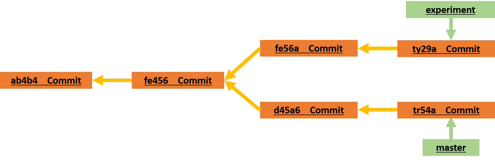

Plumbing tools in Git are low-level commands that interact directly with the Git repository's internal data structures, providing access to detailed information about commits, branches, and other objects. They are primarily used for scripting, automation, or accessing detailed repository information that may not be readily available with porcelain commands (higher-level commands). They provide direct access to the Git object database and are essential for building more complex Git workflows and tools.

## **`git rev-parse`**

This command is used to parse Git references such as branch names, commit hashes, tags, and symbolic references into commit identifiers or other meaningful information.
It can be used to retrieve the SHA-1 hash of commits, tags, and other Git objects, or to resolve symbolic references like branch names to their corresponding commit hashes.

```bash
git rev-parse HEAD         # Get the commit hash of the current HEAD
git rev-parse main         # Get the commit hash of the 'main' branch
git rev-parse v1.0         # Get the commit hash of the tag 'v1.0'
```

## **`git reflog`**

This command displays the commit history of the local repository's HEAD reference, showing a chronological list of all recent HEAD movements and associated commit identifiers.
It's useful for recovering lost commits or understanding changes to the repository's history, especially after potentially destructive operations like rebasing or resetting.

```bash
git reflog                # Show the reflog for the current branch
git reflog main           # Show the reflog for the 'main' branch

```

```
$ git reflog
734713b HEAD@{0}: commit: Fix refs handling, add gc auto, update tests
d921970 HEAD@{1}: merge phedders/rdocs: Merge made by the 'recursive' strategy.
1c002dd HEAD@{2}: commit: Add some blame and merge stuff
1c36188 HEAD@{3}: rebase -i (squash): updating HEAD
95df984 HEAD@{4}: commit: # This is a combination of two commits.
1c36188 HEAD@{5}: rebase -i (squash): updating HEAD
7e05da5 HEAD@{6}: rebase -i (pick): updating HEAD
```

Every time your branch tip is updated for any reason, Git stores that information for you in this temporary history. You can use your reflog data to refer to older commits as well. For example, if you want to see the fifth prior value of the HEAD of your repository, you can use the @{5} reference that you see in the reflog output:

```bash
git show HEAD@{5}
```

You can also use this syntax to see where a branch was some specific amount of time ago. For instance, to see where your master branch was yesterday, you can type:

```bash
git show HEAD@{yesterday}
```

That would show you where the tip of your master branch was yesterday. This technique only works for data that’s still in your reflog, so you can’t use it to look for commits older than a few months.

To see reflog information formatted like the git log output, you can run:

```bash
git log -g master
```

It’s important to note that reflog information is strictly local — it’s a log only of what you’ve done in your repository. The references won’t be the same on someone else’s copy of the repository; also, right after you initially clone a repository, you’ll have an empty reflog, as no activity has occurred yet in your repository. Running git show HEAD@{2.months.ago} will show you the matching commit only if you cloned the project at least two months ago — if you cloned it any more recently than that, you’ll see only your first local commit. Think of the reflog as Git’s version of shell history

**Escaping braces in PowerShell**

When using PowerShell, braces like { and } are special characters and must be escaped. You can escape them with a backtick ` or put the commit reference in quotes:
``` bash
git show HEAD@{0}     # will NOT work
git show HEAD@`{0`}   # OK
git show "HEAD@{0}"   # OK
```

## Ancestry References

### ^ (caret)

The other main way to specify a commit is via its ancestry. If you place a ^ (caret) at the end of a reference, Git resolves it to mean the parent of that commit. You can see the previous commit by specifying HEAD^, which means “the parent of HEAD”:

```bash
git show HEAD^
```

**Escaping the caret on Windows**
On Windows in cmd.exe, ^ is a special character and needs to be treated differently. You can either double it or put the commit reference in quotes:

``` bash
$ git show HEAD^     # will NOT work on Windows
$ git show HEAD^^    # OK
$ git show "HEAD^"   # OK
```
You can also specify a number after the ^ to identify which parent you want; for example, d921970^2 means “the second parent of d921970.” This syntax is useful only for merge commits, which have more than one parent — the first parent of a merge commit is from the branch you were on when you merged (frequently master), while the second parent of a merge commit is from the branch that was merged (say, topic).

### ~ (tilde)

The other main ancestry specification is the ~ (tilde). This also refers to the first parent, so HEAD~ and HEAD^ are equivalent. The difference becomes apparent when you specify a number. HEAD~2 means “the first parent of the first parent,” or “the grandparent” — it traverses the first parents the number of times you specify.

```bash
git show HEAD~2
```
This can also be written HEAD~~, which again is the first parent of the first parent.

You can also combine these syntaxes — you can get the second parent of the previous reference (assuming it was a merge commit) by using HEAD~3^2, and so on.

## Commit Ranges

This is particularly useful for managing your branches — if you have a lot of branches, you can use range specifications to answer questions such as, “What work is on this branch that I haven’t yet merged into my main branch?”

### Double Dot

The most common range specification is the double-dot syntax. This basically asks Git to resolve a range of commits that are reachable from one commit but aren’t reachable from another.



Say you want to see what is in your experiment branch that hasn’t yet been merged into your master branch. You can ask Git to show you a log of just those commits with master..experiment — that means “all commits reachable from experiment that aren’t reachable from master.”

```bash
git log master..experiment
```
```
ty29a
fe56a
```

If, on the other hand, you want to see the opposite — all commits in master that aren’t in experiment — you can reverse the branch names. experiment..master shows you everything in master not reachable from experiment:

```bash
git log experiment..master
```
```
tr54a
d45a6
```
This is useful if you want to keep the experiment branch up to date and preview what you’re about to merge. Another frequent use of this syntax is to see what you’re about to push to a remote:

```bash
git log origin/master..HEAD
```

This command shows you any commits in your current branch that aren’t in the master branch on your origin remote. If you run a git push and your current branch is tracking origin/master, the commits listed by git log origin/master..HEAD are the commits that will be transferred to the server. You can also leave off one side of the syntax to have Git assume HEAD. For example, you can get the same results as in the previous example by typing git log origin/master.. — Git substitutes HEAD if one side is missing.

### Multiple Points
The double-dot syntax is useful as a shorthand, but perhaps you want to specify more than two branches to indicate your revision, such as seeing what commits are in any of several branches that aren’t in the branch you’re currently on. Git allows you to do this by using either the ^ character or --not before any reference from which you don’t want to see reachable commits. Thus, the following three commands are equivalent:

```bash
git log refA..refB
git log ^refA refB
git log refB --not refA
```
This is nice because with this syntax you can specify more than two references in your query, which you cannot do with the double-dot syntax. For instance, if you want to see all commits that are reachable from refA or refB but not from refC, you can use either of:

```bash
git log refA refB ^refC
git log refA refB --not refC
```
This makes for a very powerful revision query system that should help you figure out what is in your branches.


### Triple Dot
The last major range-selection syntax is the triple-dot syntax, which specifies all the commits that are reachable by either of two references but not by both of them.

 If you want to see what is in master or experiment but not any common references, you can run:

```bash
git log master...experiment
```
Again, this gives you normal log output but shows you only the commit information for those four commits, appearing in the traditional commit date ordering.

A common switch to use with the log command in this case is --left-right, which shows you which side of the range each commit is in. 


```bash
git log --left-right master...experiment
```
```
< tr54a
< d45a6
> ty29a
> fe56a
```
With these tools, you can much more easily let Git know what commit or commits you want to inspect.

## **`git cat-file`**

This command provides various information about Git objects (commits, trees, tags, or blobs).
It can be used to display the contents, type, size, or even raw data of a specific Git object.

```bash
git cat-file -p HEAD      # Show the contents of the commit pointed to by HEAD
git cat-file -t v1.0      # Show the type of the tag 'v1.0'
```

## **`git hash-object`**
This command computes the SHA-1 hash of a given file or data and optionally stores it in the Git object database. It's commonly used for hashing file contents before storing them as Git objects or verifying data integrity.

```bash
git hash-object file.txt  # Compute the SHA-1 hash of 'file.txt'
```

## **`git ls-tree`**
This command lists the contents of a tree object (directory) in the Git object database.
It can be used to view the files and subdirectories stored within a specific tree object.

```bash
git ls-tree HEAD          # List the contents of the commit pointed to by HEAD
```

## **`git update-ref`**
This command allows you to update the references in the Git repository, such as branches or tags, directly. It's commonly used for advanced Git operations or scripting workflows that involve manipulating references.
   
```bash
git update-ref refs/heads/main <commit>  # Update the 'main' branch to point to a specific commit
```

## **`git commit-tree`**
This command creates a new commit object based on the provided tree object and parent commit(s) and optionally stores it in the Git object database.It's typically used in advanced Git workflows or scripting scenarios where manual creation of commits is necessary.

```bash
git commit-tree <tree> -p <parent> -m "Commit message"  # Create a new commit object with the given tree and parent commit
```
